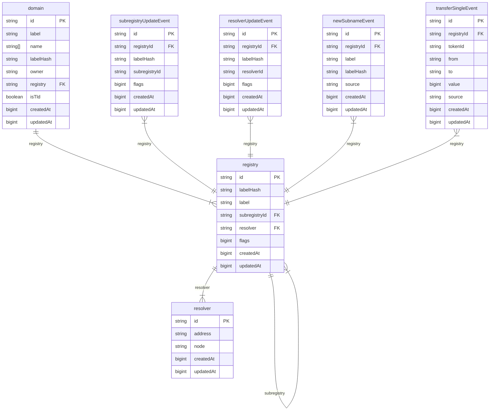

# ENS Ponder

This is a Ponder project for the ENS. It is a simple inder that stores the ENS registry, subregistries, and resolvers.

## Relations

1. Domain → Registry:
   - `domain.registry` references `registry.id`
   - Each domain belongs to one registry

2. Registry → Subregistry:
   - `registry.subregistryId` references `registry.id`
   - Registries can have subregistries (hierarchical structure)

3. Registry → Resolver:
   - `registry.resolver` references `resolver.id`
   - Each registry entry can have an associated resolver


## Difference between V1 (current ENS contracts on L1) and V2 (On namechain, L1, and other L2s)

V1:
- Only has 1 registry
- Shared resolver (eg: DefaultResolver)

V2:
- Has multiple registries (eg: EthRegistry, RootRegistry, etc.)
- Registries are hierarchical
- Each user deploy own resolver (eg: OwnedResolver)

## Schema



## Events

### Registry Events

1. `RegistryDatastore:SubregistryUpdate`
   - Creates/updates registry relationships
   - Updates subregistry mappings

2. `RegistryDatastore:ResolverUpdate`
   - Links resolvers to registry entries
   - Creates resolver records if they don't exist

### Domain Events

1. `EthRegistry:TransferSingle`
   - Creates new domain records
   - Records ownership transfers

2. `EthRegistry:NewSubname`
   - Updates domain labels
   - Links domains to registry entries

3. `RootRegistry:TransferSingle`
   - Similar to EthRegistry but for root domains
   - Creates new root domain records

4. `RootRegistry:NewSubname`
   - Updates root domain labels
   - Links root domains to registry entries

### Resolver Events

1. `OwnedResolver:AddressChanged`
   - Updates resolver address records
   - Links ENS nodes to resolved addresses

## Event Flow

1. When a new domain is created:
   - `TransferSingle` event creates the initial domain record
   - `NewSubname` event updates the domain with its label

2. When a registry relationship is established:
   - `SubregistryUpdate` creates the registry relationship
   - Links parent registry to child registry

3. When a resolver is set:
   - `ResolverUpdate` links the resolver to the registry
   - `AddressChanged` updates the resolver's address information

## ID Generation

Domain IDs are generated as composite keys:
- Format: `${registryAddress}-${labelHash}`
- Ensures unique identification across different registries
- Maintains relationship between domains and their registries

## Notes

- Currently only indexing test deployments on Sepolia
- All address fields are stored as strings
- Timestamps are stored as BigInts
- Relations are maintained through Ponder's relation system
- Events are processed in order to maintain data consistency

## Setup

```
git clone https://github.com/ensdomains/ens-ponder.git
cd ens-ponder
pnpm install
pnpm dev
```

## Todo

- Make sure it works when multiple tlds are used
- Make sure it works when a registry is the subregistry of another registry
- Add Support for UserRegistries
- Add Support for different resolver record (currently only supports ETH address)
- (Potentially) Turn it into Plugin so that it can be used in other projects